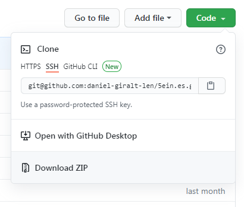

# Llengua viva

Si estàs llegint això, segurament t'interessi mantenir viu el català. I tens aficions frikis. La combinació perfecta.

Resulta que el material de Dracs i Masmorres no està traduït al català... Però podria estar-ho. Que en surti una traducció oficial del no sembla problable; i tampoc em ve de gust esperar. Aquí traduirem 5e al català!

## Els requisits
- Saber MOLT anglès
- Saber MOLT català

Opcionals (si programes aniràs més per feina):
- Saber [REGEX](https://www.sitepoint.com/learn-regex/) (expressions regulars) per traduir en massa.
- Tenir [VsCode](https://code.visualstudio.com/) per a reemplaçar regex en massa
- Saber git i tenir compte a [GitHub](https://github.com/).

## El procediment
Baixa't aquest repositori. Si no saps de github, baixa-te'l com a ZIP. **ACTUALITZA'L SOVINT!** 

Tot el contingut dels llibres està en diversos fitxers. Són fitxers JSON: un format extrany per un llibre, però que permet que el material sigui navegable a la web web.

En general, la feina consistirà en traduir els paràgrafs de text dins d'aquests fitxers (i deixar els texts petits i els caràcters extranys com estan).

La **llista de fitxers** a traduir [és aquí](translationProgress.csv). Cada fila té el nom d'un fitxer i l'estat de traducció: agafa aquells fitxers amb l'estat `NO-TRADUÏT`.

Per evitar que dues persones acabin traduint el mateix, envia pel canal de whatsapp quin fitxer estàs traduint.

Si treballes amb git, fes commit cada cop que tradueixis un objecte sencer: un capítol, un objecte, un conjur, un monstre... Divideix tan com puguis.

Si fas servir Regex, pots buscar i reemplaçar a múltiples fitxers per ajudar a traduir en massa i a estandaritzar l'estil d'escriptura a tot el material. Ves amb compte!

Un cop hagis traduït un fitxer sencer, tens dues opcions:
- Haver fet fork al repositori i fer una pull request.
- Enviar-me el fitxer a mi pel whatsapp.

Sigui com sigui, revisaré el fitxer, editaré, i el mergejaré al repositori.

## Normes generals de traducció
- Hi ha un [**Glossari**](GLOSSARI.md) de noms i expressions per assegurar una nomenclatura consistent per tot el material.
- Intentem fer el llenguatge tan neutre com sigui possible.

## Els detalls
Recursos que fem servir:
- [Diccionari.cat](http://www.diccionari.cat/) per saber si una paraula és vàlida
- [Diccionari de sinònims](https://www.softcatala.org/diccionari-de-sinonims)

[5e.tools](https://5e.tools/index.html) és una pàgina web que té molt contingut de DnD 5e online de franc, i és la que ens serveix com a base. Els autors animen a clonar-la d'aquesta manera.